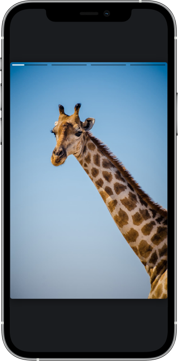

<h1 align="center">
  Slide
</h1>

<h2 align="center">
   Slide desenvolvido para eu aperfeiçoar minhas habilidades com o JavaScript.
</h2>

<h3 align="center">
    O projeto se consiste em um slide feito para ficar parecido com os stories do Instagram, com ele eu me aprofundei sobre boas práticas de programação com JavaScript e aprendi que eu não devo ficar enxendo meus sistemas com frameworks e plugins de terceiros pois isso pode pesar muito no sistema e demandar muita manutenção no futuro.
</h3>

<h1 align="center">Demonstração</h1>

    

## Technologies

As tecnologias utilizadas foram: HTML, CSS e JavaScript.

## Features

- [x] Responsividade
- [x] Não utilizar frameworks e bibliotecas
- [x] Deploy através do Github pages
- [x] Boas práticas de programação
- [x] JavaScript

## Getting started

Você pode abrir o website através do link abaixo em um navegador moderno e ver o que foi desenvovido.

<a href="https://anderson-andre-p.github.io/slide-from-scratch/" target="" alt="Website">Clique aqui</a>

<!-- `https://anderson-andre-p.github.io/christmas-website/` -->

_O website funciona em qualquer navegador moderno_

Se você quiser baixar o repositório no seu computador digite o comand abaixo em um terminal

`git clone git@github.com:Anderson-Andre-P/slide-from-scratch.git`

## Autor

---

<a href="https://www.linkedin.com/in/anderson-andre-pereira/">
 <!--  -->
 <!--   -->
 <b>Anderson André</b></a> <a href="https://www.linkedin.com/in/anderson-andre-pereira/" title="LinkedIn">🚀</a>

Elaborado por Anderson André 👋🏽 Entre em contato!

 
 
  
   

